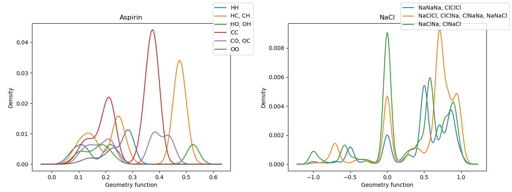

# mbtr
A code for calculating MBTR molecule/crystal structure representation. ([arXiv:1704.06439](https://arxiv.org/abs/1704.06439))

**The code is now Alpha release**. Feel free to report any bugs and errors in this implementation.

# Installation

```bash
git clone git@github.com:hhaoyan/mbtr.git
pip install -e .
```

# Visualizing aspirin structure

```bash
python examples/visualize.py
```


