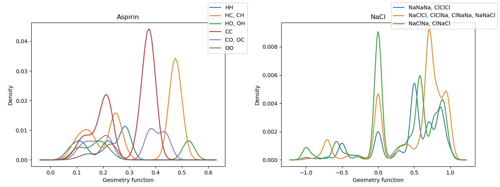

# An implementation of many-body tensor representation
A code for calculating MBTR molecule/crystal structure representation. ([arXiv:1704.06439](https://arxiv.org/abs/1704.06439))

**The code is now Alpha release**. Feel free to report any bugs and errors in this implementation.

# Installation

```bash
git clone git@github.com:hhaoyan/mbtr.git
pip install -e .
```

# Visualizing aspirin/sodium chloride structure

```bash
python examples/visualize.py
```



# Learning to predict molecular atomization energies

```bash
$ python examples/gdb7_atomization_energy.py
2019-01-12 18:59:36,365 - INFO - Loaded 7211 molecules
2019-01-12 18:59:36,365 - INFO - Computing 2D MBTR, geometry function: 1/pairwise_distance, weighting function: pairwise_distance**2, density function: N(0, 0.0600), correlation function: delta(z1, z2), range: [-0.160, 1.300].
2019-01-12 18:59:40,664 - INFO - Computing 3D MBTR, geometry function: angle(A, B, C), weighting function: 1/r1r2r3, density function: N(0, 0.1800), correlation function: delta(z1, z2, z3), range: [-0.540, 3.682].
2019-01-12 19:03:30,452 - INFO - Model selection training/validation size: 4700/300, production training/validation size: 5000/2211
2019-01-12 19:03:34,018 - DEBUG - (σ: 5.00000e+03, λ: 1.00000e-03) ==> RMSE: 24.323637, MAE: 19.153325, R2: 0.986567
2019-01-12 19:03:37,560 - DEBUG - (σ: 5.25000e+03, λ: 1.00000e-03) ==> RMSE: 24.784932, MAE: 19.475491, R2: 0.986053
2019-01-12 19:03:41,108 - DEBUG - (σ: 4.75000e+03, λ: 1.00000e-03) ==> RMSE: 23.867172, MAE: 18.819403, R2: 0.987067
2019-01-12 19:03:41,139 - DEBUG - Now 23.867172, 24.323637, 24.784932 at σ = 5000.000000
2019-01-12 19:03:44,572 - DEBUG - (σ: 2.50000e+03, λ: 1.00000e-03) ==> RMSE: 19.490863, MAE: 15.213737, R2: 0.991375
2019-01-12 19:03:44,603 - DEBUG - Select down - 0.500000.
2019-01-12 19:03:48,183 - DEBUG - (σ: 2.62500e+03, λ: 1.00000e-03) ==> RMSE: 19.813462, MAE: 15.462525, R2: 0.991087
2019-01-12 19:03:51,845 - DEBUG - (σ: 2.37500e+03, λ: 1.00000e-03) ==> RMSE: 19.142194, MAE: 14.952035, R2: 0.991681
2019-01-12 19:03:51,875 - DEBUG - Now 19.142194, 19.490863, 19.813462 at σ = 2500.000000
2019-01-12 19:03:55,407 - DEBUG - (σ: 1.25000e+03, λ: 1.00000e-03) ==> RMSE: 14.291038, MAE: 10.968226, R2: 0.995363
2019-01-12 19:03:55,439 - DEBUG - Select down - 0.500000.
2019-01-12 19:03:59,024 - DEBUG - (σ: 1.31250e+03, λ: 1.00000e-03) ==> RMSE: 14.638786, MAE: 11.305070, R2: 0.995135
2019-01-12 19:04:02,706 - DEBUG - (σ: 1.18750e+03, λ: 1.00000e-03) ==> RMSE: 13.937070, MAE: 10.617786, R2: 0.995590
2019-01-12 19:04:02,738 - DEBUG - Now 13.937070, 14.291038, 14.638786 at σ = 1250.000000
2019-01-12 19:04:06,389 - DEBUG - (σ: 6.25000e+02, λ: 1.00000e-03) ==> RMSE: 10.252432, MAE: 7.703704, R2: 0.997613
2019-01-12 19:04:06,428 - DEBUG - Select down - 0.500000.
2019-01-12 19:04:10,027 - DEBUG - (σ: 6.56250e+02, λ: 1.00000e-03) ==> RMSE: 10.507470, MAE: 7.890759, R2: 0.997493
...
2019-01-12 19:08:18,265 - DEBUG - (σ: 5.34526e+03, λ: 1.86264e-12) ==> RMSE: 1.223878, MAE: 0.884187, R2: 0.999966
2019-01-12 19:08:21,765 - DEBUG - (σ: 4.83619e+03, λ: 1.86264e-12) ==> RMSE: 1.227627, MAE: 0.885488, R2: 0.999966
2019-01-12 19:08:21,794 - DEBUG - Now 1.227627, 1.234103, 1.223878 at σ = 5090.728000
2019-01-12 19:08:21,794 - INFO - Final parameters: sigma: 5.09073e+03, 1.86264e-12
2019-01-12 19:08:28,660 - DEBUG - Model performance on test set: RMSE: 1.338557, MAE: 0.913202, R2: 0.999962
```

Depending on randomness (and luck), you may get different final results.

# Citations

If you use this code in your research, please consider citing:

```latex
@article{huo2017unified,
  title={Unified representation for machine learning of molecules and crystals},
  author={Huo, Haoyan and Rupp, Matthias},
  journal={arXiv:1704.06439},
  year={2017}
}
```
